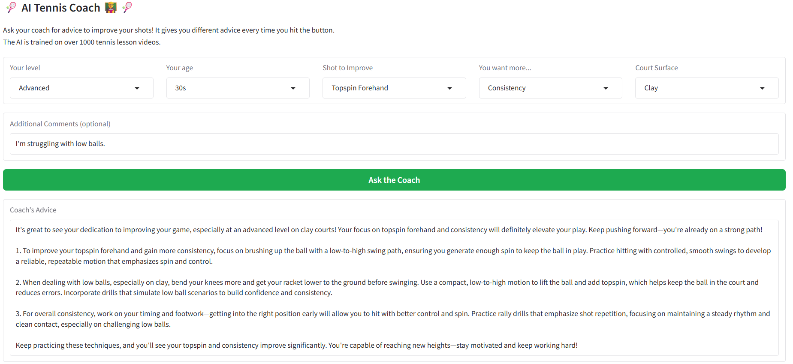

# AI Tennis Coach
A smart tennis assistant trained on over 1,000 lesson videos (with CC licenses) on YouTube from top coaching channels.  

This app helps players of all levels improve their shots by giving **personalized, practical, and structured advice**.

Powered by OpenAI and LangChain.

The Gradio app is deployed in HuggingFace → https://huggingface.co/spaces/YuSak1/ai-tennis-coach

    

## Requirements
Python 3.10.5

See requirements.txt

## Approach
- Accepts users' tennis level, age, shot focus, and training goals
- Lets user add custom comments (e.g., "I struggle with high balls" or "I’m off-balance on backhand")
- Retrieves relevant tips from a vector database of transcripts created from YouTube videos
- Responds like a real tennis coach

## Future Work
- Take videos as input combined with prompts, and provide more tailored advice.
